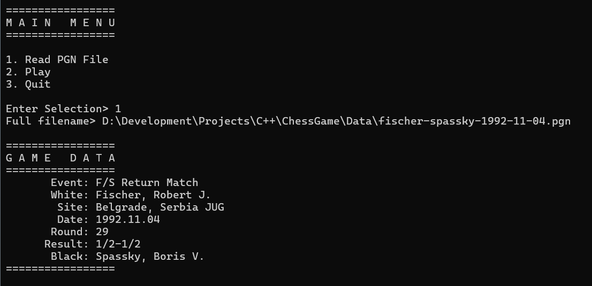
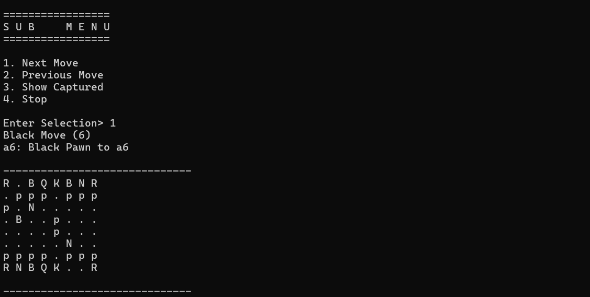

<a name="readme-top"></a>

<!-- PROJECT LOGO -->
<br />
<div align="center">
  <a href="https://github.com/Adam-Gladstone/ChessGame">
    
  </a>

  <h3 align="center">Chess Game</h3>

  <p align="center">
    <br />
    <a href="https://github.com/Adam-Gladstone/ChessGame"><strong>Explore the docs »</strong></a>
    <br />
    <br />
    <a href="https://github.com/Adam-Gladstone/ChessGame/issues">Report Bug</a>
    ·
    <a href="https://github.com/Adam-Gladstone/ChessGame/issues">Request Feature</a>
  </p>
</div>

<!-- TABLE OF CONTENTS -->
<details>
  <summary>Table of Contents</summary>
  <ol>
    <li>
      <a href="#about-the-project">About The Project</a>
      <ul>
        <li><a href="#built-with">Built With</a></li>
      </ul>
    </li>
    <li>
      <a href="#getting-started">Getting Started</a>
      <ul>
        <li><a href="#prerequisites">Prerequisites</a></li>
        <li><a href="#installation">Installation</a></li>
      </ul>
    </li>
    <li><a href="#usage">Usage</a></li>
    <li><a href="#roadmap">Roadmap</a></li>
    <li><a href="#license">License</a></li>
    <li><a href="#contact">Contact</a></li>
    <li><a href="#acknowledgments">Acknowledgments</a></li>
  </ol>
</details>

<!-- ABOUT THE PROJECT -->
## About The Project

This project is currently unfinished. It is a work in progress (see the CHANGELOG.md for a list of current issues and future directions). The project started out as a challenge after failing a job interview last month. The interview was for a C++ generalist role at a games company. In the last fifteen minutes of the interview I was asked to ___design a chess game___. This threw me somewhat, as it is a little outside the (application) software I usually design and my knowledge of chess is rather basic. Furthermore, the requirement appeared sufficiently complex that I needed more time to put my ideas in order. So I burbled something incoherent about a game board and pieces and so on. As a result, I didn't get invited back for a further interview. However, the challenge got me thinking, and this project is the result.

The main focus of this project was to take a chess move (or a series of moves, a game in fact), in short PGN (https://en.wikipedia.org/wiki/Portable_Game_Notation) form and represent them on a chess board, essentially parsing a PGN move into a real move.

Given a list of moves, the user can step through a game, viewing the progress, until completion.

There are a number of aspects of the implementation that have been left for future development (time permitting).
* The gameplay is extremely limited. At the moment it is only possible to step through game moves (in one direction - forward only).
* The parsing of PGN files does not handle inlined comments.
* The testing is quite limited. There is at least one situation (__en passant__ promotion) that is not handled at all.
* Currently, the game does not support any sort of automatic play. There is no notion of an opponent (computer or human).

### Project structure
There are three projects in the ChessGame.sln solution file:
* ChessGameConsole
* ChessGameLib
* ChessGameTest

#### ChessGameConsole
This is a simple console application that links to the core ChessGameLib. The console provides the main entrypoint and support for user interaction via menus in the MenuManager class. In the future, I hope to replace the console application with a 'proper' user interface using WinUI and XAML (similar in this regard to the Wordle game: https://github.com/Adam-Gladstone/Wordle).

#### ChessGameLib
The bulk of the code is in the ChessGameLib. This project is written in C++20 and demonstrates (among other things) the following:
- structured bindings
- ranges and filtering
- constexpr usage

The main classes are the ```Piece```, the ```Move``` and the ```Game``` classes. The ```Piece``` is used to represent a chess piece via a type, a color and also a position on the game board. The type of piece and the color are both enums. The ```Move``` class deals with a single game move specified via the PGN text. Hence, we can represent a game (read in via a PGN text file) as a vector of moves. The ```Game``` class contains the board. This is defined naturally as an array of pieces, as follows:

```using Board = std::array<chess::Piece, 64>;```

The ```Game``` class also contains a vector of captured pieces. Game initialisation deals with the initial setup and display of the game board. The board can take on any valid state with the pieces being specified in an initialisation list. For example, to place a white king at f5 we can use the following:

```	
static constexpr std::array<Piece, 1> setup{ Piece{ king, white, {'f', 5} } };
```

This is useful for testing. The game has a default initial setup which places the black and white pieces in their traditional locations.

The main function of the ```Game``` class is to execute turns. Each turn is parameterised with a ```Move``` (possibly from a vector of moves). The turn determines if the move is a castling move (in which case two pieces change positions, if the castling constraints are satisfied) or it is a regular (possibly attacking) move. 

It turns out that most of the logic concerns how to determine if the source position for a destination specified in PGN is valid. Since the short PGN does not explicitly specify the source, we need to find whether there is a valid path back from the destination, which is specified in the PGN. This involves determining what type of piece is performing the move and the legal moves available (e.g. is it in bounds? can it 'jump over' pieces like a knight? and so on).

To do this, we distinguish between pieces that move fixed offsets (king, knight and pawn) and pieces that move along unobstructed paths (queen, bishop, rook) unless they are attacking. The ```get_moves``` function (in Move.h) retrieves a list of valid moves for a specied piece type in a specified location (taking into account bounds and other pieces on the board). This list of legal moves is then compared to the requested destination, and if present it is considered a valid move. This seems quite a complicated approach but it is due to the short PGN not specifying the source (only the destination). Almost certainly there are better ways to accomplish this.

Once the move is considered valid, ```move_piece``` is called which updates the state of the board. The Game then can display the new state.

Other auxiliary classes are ```Position``` and ```Coord``` which handle translating between PGN and the game board as represented by the array of pieces.

#### ChessGameTest
This is a Google test project that exercises some of the functionality provided in the ChessGameLib.

<p align="right">(<a href="#readme-top">back to top</a>)</p>

### Built With

* Visual Studio 2022
* C++20
* GoogleTest

<p align="right">(<a href="#readme-top">back to top</a>)</p>

<!-- GETTING STARTED -->
## Getting Started

The project can be downloaded from the GitHub repository in the usual way.

### Prerequisites


### Installation


<p align="right">(<a href="#readme-top">back to top</a>)</p>

<!-- USAGE EXAMPLES -->
## Usage

On running the ChessGameConsole.exe you are presented with three menu options.
1. Read a PGN File
2. Play
3. Quit

'Quit' just exits the application. 'Read a PGN File' requests the full filename of a PGN file. There are three of these available in the \data directory. Enter the filename (without quotes) '..\ChessGame\Data\fischer-spassky-1992-11-04.pgn'. This is just a text file (copied from Wikipedia in this case) and edited to remove the comments as the current PGN parser doesn't support them. This is noted in the CHANGELOG.md as a future enhancement.

Once the file is read, a list of chess moves is created. The game data is displayed as shown in this screenshot:



Back to the Main Menu, and now we can select 'Play'. This displays a new board (black at the top, as is traditional) with the pieces in their default locations. A future enhancement is to use unicode chess characters for the display in order to distinguish colors. 

Selecting 'Play' brings up a sub-menu for controlling the moves:

1. Next Move
2. Previous Move
3. Show Captured
4. Stop

Selecting the 'Stop' menu simply returns to the main menu. The 'Next Move' menu allows you to repeatedly cycle through each move and observe the game on the board:



Apart from the board player positions, the output displays the parsed PGN text. You can also view a list of captured pieces with the menu 'Show Captured'.

Once the moves are completed, another game can be loaded and so on. 

It is also possible to manually enter moves and see the result on the game board.

<p align="right">(<a href="#readme-top">back to top</a>)</p>

<!-- ROADMAP -->
## Roadmap

See the [open issues](https://github.com/Adam-Gladstone/ChessGame/issues) for a full list of proposed features (and known issues).

<p align="right">(<a href="#readme-top">back to top</a>)</p>

<!-- LICENSE -->
## License

Distributed under the GPL-3.0 License. See `LICENSE.md` for more information.

<p align="right">(<a href="#readme-top">back to top</a>)</p>

<!-- CONTACT -->
## Contact

Adam Gladstone - (https://www.linkedin.com/in/adam-gladstone-b6458b156/)

Project Link: [https://github.com/Adam-Gladstone/ChessGame](https://github.com/Adam-Gladstone/ChessGame)

<p align="right">(<a href="#readme-top">back to top</a>)</p>

<!-- ACKNOWLEDGMENTS -->
## Acknowledgments

Helpful resources

* [Choose an Open Source License](https://choosealicense.com)
* [Img Shields](https://shields.io)
* [GitHub Pages](https://pages.github.com)
* [Font Awesome](https://fontawesome.com)
* [React Icons](https://react-icons.github.io/react-icons/search)

<p align="right">(<a href="#readme-top">back to top</a>)</p>

<!-- PROJECT SHIELDS -->

[![Issues][issues-shield]][issues-url]
[![GPL-3 License][license-shield]][license-url]
[![LinkedIn][linkedin-shield]][linkedin-url]

<!-- MARKDOWN LINKS & IMAGES -->
<!-- https://www.markdownguide.org/basic-syntax/#reference-style-links -->

[issues-shield]: https://img.shields.io/github/issues/Adam-Gladstone/ChessGame.svg?style=for-the-badge
[issues-url]: https://github.com/Adam-Gladstone/ChessGame/issues

[license-shield]: https://img.shields.io/github/license/Adam-Gladstone/ChessGame.svg?style=for-the-badge
[license-url]: https://github.com/Adam-Gladstone/ChessGame/LICENSE.md

[linkedin-shield]: https://img.shields.io/badge/-LinkedIn-black.svg?style=for-the-badge&logo=linkedin&colorB=555
[linkedin-url]: https://www.linkedin.com/in/adam-gladstone-b6458b156/
